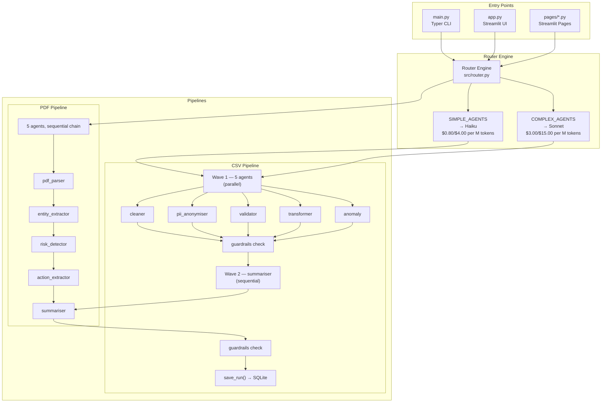
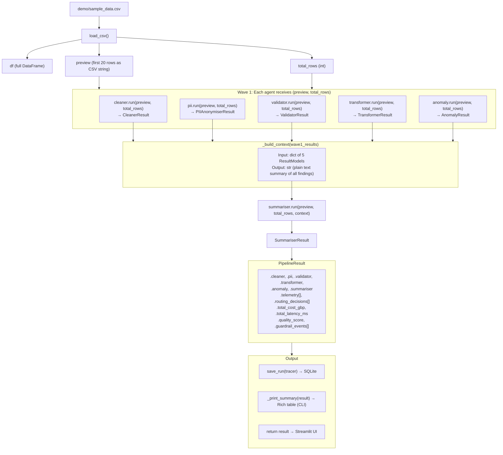
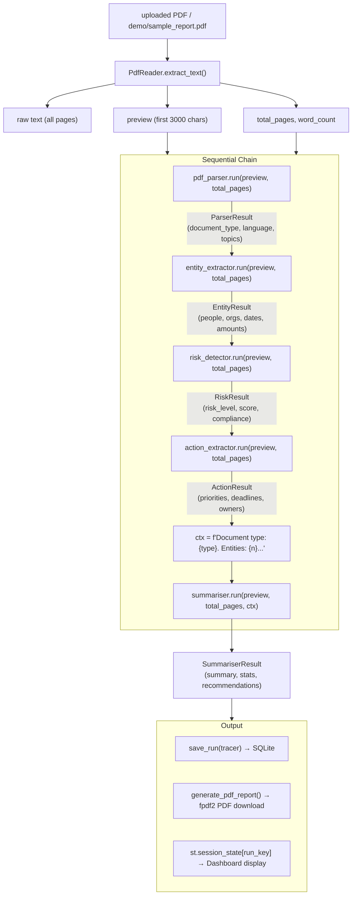
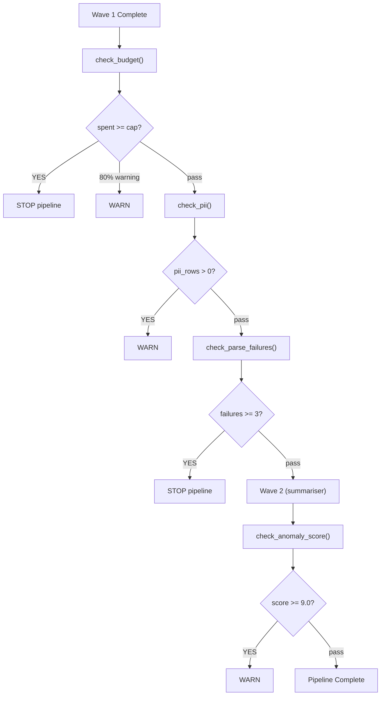

# Architecture & Design

Multi-Agent Data Pipeline — 11 AI agents processing CSV and PDF data through two distinct pipelines with cost-aware routing, guardrails, and full observability.

---

## 1. System Overview



---

## 2. CSV Pipeline Architecture

The CSV pipeline is a two-wave orchestrator with parallel execution, guardrail gates, and SQLite persistence.

**Entry:** `run_pipeline(file_path, routing_enabled, guardrails, api_key)` in `src/pipeline.py` (256 lines).

### Execution Flow

```mermaid
flowchart TD
    A["1. load_csv(file_path)"] --> B["df, preview (first 20 rows), total_rows"]
    B --> C["2. ROUTING: get_model(agent_name) for each of 6 agents"]
    C --> D["RouterDecision per agent (Haiku or Sonnet)"]

    subgraph Wave 1 ["WAVE 1 — ThreadPoolExecutor(max_workers=5)"]
        E1["cleaner<br/>(Haiku)"]
        E2["pii_anonymiser<br/>(Haiku)"]
        E3["validator<br/>(Sonnet)"]
        E4["transformer<br/>(Haiku)"]
        E5["anomaly<br/>(Sonnet)"]
    end

    D --> Wave 1

    E1 --> F["3. GUARDRAILS CHECK (post-Wave 1)"]
    E2 --> F
    E3 --> F
    E4 --> F
    E5 --> F

    F --> F1["Budget cap: £0.50 max"]
    F --> F2["PII density: warn if rows affected > 0"]
    F --> F3["Parse failures: stop if >= 3"]

    F1 --> G["4. _build_context(wave1_results)"]
    F2 --> G
    F3 --> G

    G --> H["String summary of Wave 1 findings for Wave 2"]

    subgraph Wave 2 ["WAVE 2 — Sequential"]
        I["summariser (Sonnet)<br/>◄── receives context from all 5 agents"]
    end

    H --> Wave 2

    I --> J["5. GUARDRAILS CHECK (post-Wave 2)"]
    J --> J1["Anomaly score: warn if >= 9.0/10"]

    J1 --> K["6. save_run(tracer) → SQLite"]
    K --> L["7. _print_summary(result) → Rich table to console"]
    L --> M["8. return PipelineResult"]
```

### Context Building

The summariser needs context from all Wave 1 agents. `_build_context()` constructs a plain-text summary:

```python
def _build_context(wave1_results: dict) -> str:
    parts = []
    if wave1_results.get("cleaner"):
        r = wave1_results["cleaner"]
        parts.append(f"Cleaner: {len(r.issues_fixed)} issues fixed, {r.rows_affected} rows affected.")
    if wave1_results.get("pii_anonymiser"):
        r = wave1_results["pii_anonymiser"]
        parts.append(f"PII: {r.rows_affected} rows had PII ({', '.join(r.pii_types_detected) or 'none'}).")
    if wave1_results.get("validator"):
        r = wave1_results["validator"]
        parts.append(f"Validator: {r.completeness_score}% completeness, {len(r.violations)} violations.")
    if wave1_results.get("transformer"):
        r = wave1_results["transformer"]
        parts.append(f"Transformer: {r.rows_transformed} rows transformed, {len(r.new_columns)} new columns.")
    if wave1_results.get("anomaly"):
        r = wave1_results["anomaly"]
        parts.append(f"Anomaly: {r.anomaly_count} anomalies, risk score {r.anomaly_score}/10.")
    return "\n".join(parts)
```

Example context string:

```
Cleaner: 3 issues fixed, 5 rows affected.
PII: 2 rows had PII (email, phone).
Validator: 87.5% completeness, 1 violations.
Transformer: 10 rows transformed, 2 new columns.
Anomaly: 2 anomalies, risk score 6.5/10.
```

---

## 3. PDF Pipeline Architecture

The PDF pipeline runs 5 agents **sequentially** in `pages/pdf_intelligence.py` (323 lines). Each agent receives the previous agent's output as context.

### Execution Flow

```mermaid
flowchart TD
    A["1. PdfReader(file).extract_text()"] --> B["raw text (all pages)"]
    B --> C["preview (first 3000 chars)"]
    B --> D["total_pages, word_count"]

    E["2. Router assigns models<br/>(if routing_enabled)"] --> E1["pdf_parser → Haiku"]
    E --> E2["entity_extractor → Haiku"]
    E --> E3["risk_detector → Sonnet"]
    E --> E4["action_extractor → Sonnet"]
    E --> E5["summariser → Sonnet"]

    subgraph Sequential Chain ["SEQUENTIAL CHAIN (each agent blocks, next receives output)"]
        F1["pdf_parser.run(preview, total_pages)"]
        F2["entity_extractor.run(preview, total_pages)"]
        F3["risk_detector.run(preview, total_pages)"]
        F4["action_extractor.run(preview, total_pages)"]
        F5["summariser.run(preview, total_pages, ctx)"]

        F1 -->|"document_type, language, topics..."| F2
        F2 -->|"people, orgs, dates, amounts..."| F3
        F3 -->|"risk_level, score, compliance..."| F4
        F4 -->|"priorities, deadlines, owners..."| F5
    end

    C --> Sequential Chain
    D --> Sequential Chain
    E1 -.-> F1
    E2 -.-> F2
    E3 -.-> F3
    E4 -.-> F4
    E5 -.-> F5

    F4 --> G["3. Context string built from agents 1-4"]
    G --> H["ctx = 'Document type: {type}. Entities: {n}.<br/>Risk level: {level}, score: {score}/10.<br/>Actions: {n}.'"]

    F5 --> I["4. save_run(tracer) → SQLite"]
    I --> J["5. Optional: generate_pdf_report() via fpdf2"]
```

### Key Difference from CSV Pipeline

| Aspect | CSV Pipeline | PDF Pipeline |
|--------|-------------|--------------|
| Execution | 2 waves (parallel + sequential) | Pure sequential chain |
| Parallelism | ThreadPoolExecutor(5) | None — one agent at a time |
| Context | Aggregated from Wave 1 results | Chained agent-to-agent |
| Guardrails | Budget, PII, parse failures, anomaly | None (uses credit system) |
| Persistence | SQLite via `save_run()` | SQLite via `save_run()` |

---

## 4. Router Engine

The router assigns models based on agent complexity. Lives in `src/router.py` (54 lines).

### Decision Logic

```python
SIMPLE_AGENTS = {"cleaner", "pii_anonymiser", "transformer"}
COMPLEX_AGENTS = {"validator", "anomaly", "summariser",
                  "pdf_parser", "entity_extractor", "risk_detector", "action_extractor"}

def route(agent_name: str, total_rows: int = 0, routing_enabled: bool = True) -> RouterDecision:
    if not routing_enabled:
        # All agents use Sonnet (baseline mode)
        return RouterDecision(model=MODELS["quality"], model_label="Sonnet", ...)

    if agent_name in SIMPLE_AGENTS:
        # Mechanical tasks — Haiku is sufficient
        return RouterDecision(model=MODELS["fast"], model_label="Haiku", ...)
    elif agent_name in COMPLEX_AGENTS:
        # Reasoning tasks — Sonnet required
        return RouterDecision(model=MODELS["quality"], model_label="Sonnet", ...)
    else:
        # Unknown agent — default to Sonnet
        return RouterDecision(model=MODELS["quality"], model_label="Sonnet", ...)
```

### Model Assignment

| Agent | Type | Model | Max Tokens | Timeout |
|-------|------|-------|------------|---------|
| cleaner | Simple | Haiku | 400 | 12s |
| pii_anonymiser | Simple | Haiku | 350 | 10s |
| transformer | Simple | Haiku | 400 | 12s |
| validator | Complex | Sonnet | 600 | 18s |
| anomaly | Complex | Sonnet | 550 | 18s |
| summariser | Complex | Sonnet | 1000 | 20s |
| pdf_parser | Complex | Sonnet | 600 | 15s |
| entity_extractor | Complex | Sonnet | 700 | 15s |
| risk_detector | Complex | Sonnet | 600 | 15s |
| action_extractor | Complex | Sonnet | 600 | 15s |

### Cost Savings

With routing enabled, 3 of 6 CSV agents use Haiku (~4x cheaper):

| Metric | Baseline (all Sonnet) | With Router |
|--------|----------------------|-------------|
| CSV agents using Sonnet | 6/6 | 3/6 |
| PDF agents using Sonnet | 5/5 | 3/5 |
| Estimated savings | — | ~60% on routed agents |

**Pricing (USD per M tokens):**

| Model | Input | Output | GBP (×0.79) |
|-------|-------|--------|-------------|
| Haiku | $0.80 | $4.00 | £0.63 / £3.16 |
| Sonnet | $3.00 | $15.00 | £2.37 / £11.85 |

---

## 5. Agent Pattern

Every agent in `src/agents/` follows an identical interface. This is the contract:

### Common Interface

```python
def run(csv_preview: str, total_rows: int,
        model: str = None, span=None) -> ResultModel:
    """
    Args:
        csv_preview: First 20 rows as CSV string
        total_rows: Total row count in dataset
        model: Override model ID (e.g. "claude-haiku-4-5-20251001")
        span: AgentSpan for observability (tokens, cost, latency)

    Returns:
        ResultModel: Pydantic-validated result, never None
    """
```

### Full Agent Implementation (cleaner.py)

```python
import os
import json
from anthropic import Anthropic
from src.models import CleanerResult
from src.cost_config import MODELS, AGENT_MAX_TOKENS

SYSTEM_PROMPT = """You are a data cleaning agent.
Your job is to analyse CSV data and identify all cleaning issues.
You must respond ONLY with valid JSON. No explanation, no markdown, no code fences.
JSON format:
{
    "issues_fixed": ["list of issues you found and fixed"],
    "rows_affected": 5,
    "cleaned_columns": ["col1", "col2"]
}"""

def run(csv_preview: str, total_rows: int,
        model: str = None, span=None) -> CleanerResult:
    if model is None:
        model = MODELS["quality"]
    client = Anthropic(api_key=os.getenv("ANTHROPIC_API_KEY"))
    user_msg = f"Clean this CSV data ({total_rows} total rows):\n\n{csv_preview}"

    try:
        response = client.messages.create(
            model=model,
            max_tokens=AGENT_MAX_TOKENS["cleaner"],
            system=SYSTEM_PROMPT,
            messages=[{"role": "user", "content": user_msg}]
        )
        raw = response.content[0].text.strip()
        raw = raw.removeprefix("```json").removeprefix("```")
        raw = raw.removesuffix("```").strip()
        data = json.loads(raw)
        result = CleanerResult(**data)

        if span:
            span.finish(
                input_tokens=response.usage.input_tokens,
                output_tokens=response.usage.output_tokens,
                model=model, raw_response=raw,
                parsed_output=str(result.model_dump()), parse_ok=True
            )
        return result

    except Exception as e:
        # NEVER crash the pipeline — return fallback result
        fallback = CleanerResult(
            issues_fixed=["Could not parse response"],
            rows_affected=0,
            cleaned_columns=[]
        )
        if span:
            span.finish(input_tokens=0, output_tokens=0, model=model,
                        raw_response="", parsed_output="",
                        parse_ok=False, error_message=str(e))
        return fallback
```

### Error Handling Pattern

Every agent follows the same safety guarantee:

```python
# The try/except is the contract:
try:
    # 1. Call Anthropic API
    # 2. Strip markdown fences from response
    # 3. Parse JSON
    # 4. Validate with Pydantic
    # 5. Record telemetry on span
    return result

except Exception as e:
    # 6. Return fallback result — NEVER raise
    fallback = ResultModel(
        field=["Could not parse response"],  # or similar
        ...
    )
    if span:
        span.finish(parse_ok=False, error_message=str(e))
    return fallback
```

**Guarantee:** Agents never crash the pipeline. If the LLM returns malformed JSON, times out, or the API errors, a fallback result is returned with zero useful data but valid structure.

### PII Anonymiser — The Exception

The PII anonymiser uses **regex only** — no LLM call, zero cost:

```python
# src/agents/pii_anonymiser.py
# Uses regex patterns to detect emails, phone numbers, SSNs, etc.
# Runs locally, no Anthropic API call
# Zero token cost — always Haiku in routing (but doesn't matter)
```

---

## 6. Parallelism Model

### ThreadPoolExecutor

Wave 1 runs 5 agents concurrently using `concurrent.futures.ThreadPoolExecutor`:

```python
wave1_agents = {
    "cleaner":       (cleaner.run,       {"csv_preview": preview, "total_rows": total_rows}),
    "pii_anonymiser":(pii_anonymiser.run, {"csv_preview": preview, "total_rows": total_rows}),
    "validator":     (validator.run,      {"csv_preview": preview, "total_rows": total_rows}),
    "transformer":   (transformer.run,    {"csv_preview": preview, "total_rows": total_rows}),
    "anomaly":       (anomaly.run,        {"csv_preview": preview, "total_rows": total_rows}),
}

with concurrent.futures.ThreadPoolExecutor(max_workers=5) as executor:
    futures = {
        name: executor.submit(fn, **{**args, "model": spans[name].model, "span": spans[name]})
        for name, (fn, args) in wave1_agents.items()
    }
    for name, future in futures.items():
        timeout_s = AGENT_TIMEOUTS.get(name, 20)
        try:
            wave1_results[name] = future.result(timeout=timeout_s)
        except concurrent.futures.TimeoutError:
            spans[name].finish_timeout()
            wave1_results[name] = None
        except Exception as e:
            spans[name].finish(0, 0, spans[name].model, "", "", False, str(e))
            wave1_results[name] = None
```

### Timeout Handling

Each agent has an individual timeout (defined in `AGENT_TIMEOUTS`):

| Agent | Timeout |
|-------|---------|
| cleaner | 12s |
| pii_anonymiser | 10s |
| validator | 18s |
| transformer | 12s |
| anomaly | 18s |
| summariser | 20s |

If an agent times out:
1. `future.result(timeout=...)` raises `TimeoutError`
2. `span.finish_timeout()` records the event
3. `wave1_results[name]` is set to `None`
4. Pipeline continues — other agents are unaffected
5. Summariser skips the missing agent's context in `_build_context()`

### Thread Safety

- Each agent creates its own `Anthropic` client instance (no shared state)
- `AgentSpan` writes are append-only (safe under GIL)
- `RunTracer` aggregates spans after all futures complete (no concurrent mutation)

---

## 7. Data Flow Diagrams

### CSV Pipeline Data Flow



### PDF Pipeline Data Flow



---

## 8. Guardrails System

The `GuardrailEngine` in `src/observability/guardrails.py` enforces safety constraints at specific pipeline checkpoints.

### Guardrail Checks

| Guardrail | Type | Threshold | Action | Pipeline |
|-----------|------|-----------|--------|----------|
| Budget cap | `budget_cap` | £0.50 | **stop** if exceeded, warn at 80% | CSV |
| PII density | `pii_rows_detected` | 0 rows | warn if PII found | CSV |
| Parse failures | `parse_failure_streak` | 3 | **stop** if >= 3 | CSV |
| Anomaly score | `anomaly_score` | 9.0/10 | warn if >= 9.0 | CSV |
| Completeness | `completeness_score` | 60% | warn if below | CSV |

### Guardrail Flow



### GuardrailResult Structure

```python
@dataclass
class GuardrailResult:
    passed: bool                          # Did the check pass?
    action: Literal["continue", "warn", "stop", "skip"]
    reason: str                           # Human-readable explanation
    severity: Literal["info", "warning", "critical"]
    guardrail_type: str                   # e.g. "budget_cap"
    value: float                          # Actual value measured
    threshold: float                      # Threshold that was checked against
```

---

## 9. Observability

### Tracing

The `RunTracer` (`src/observability/tracer.py`) captures per-run telemetry:

```python
tracer = RunTracer(source="sample_data.csv", mode="with_router")

# Start a span for each agent
span = tracer.start_span("cleaner", model="claude-haiku-4-5-20251001")

# Agent calls span.finish() with results
span.finish(
    input_tokens=1234,
    output_tokens=56,
    model="claude-haiku-4-5-20251001",
    raw_response='{"issues_fixed": [...], ...}',  # truncated to 2000 chars
    parsed_output='CleanerResult(...)',             # truncated to 2000 chars
    parse_ok=True
)

# Tracer aggregates totals
print(tracer.total_cost_gbp)   # sum of all spans
print(tracer.total_latency_ms) # sum of all span latencies
print(tracer.parse_failures)   # count of spans with parse_ok=False
```

### Quality Score

```python
quality = max(0, (parse_ok_count / total_agents * 100) - (timeout_count * 15))
```

Each timeout costs 15 percentage points. A full parse with no timeouts = 100%.

---

## 10. File Structure

| File | Lines | Purpose |
|------|-------|---------|
| `app.py` | 68 | Streamlit UI orchestrator — hero page, mode selector |
| `main.py` | 40 | Typer CLI: `python main.py demo/sample_data.csv --output results.json` |
| `src/pipeline.py` | 256 | CSV orchestrator — Wave 1 parallel, Wave 2 sequential, guardrails |
| `src/router.py` | 54 | Model assignment: Haiku for simple, Sonnet for complex |
| `src/models.py` | 84 | All Pydantic v2 schemas (6 agent results + telemetry + pipeline result) |
| `src/cost_config.py` | 59 | Model IDs, pricing, token limits, timeouts |
| `src/agents/*.py` | ~50 each | 10 agents following the common interface |
| `src/observability/tracer.py` | — | RunTracer + AgentSpan for per-run telemetry |
| `src/observability/store.py` | — | SQLite persistence via `save_run()` |
| `src/observability/guardrails.py` | 115 | GuardrailEngine with 5 check types |
| `src/report_generator.py` | — | fpdf2 PDF report builder |
| `src/pages/pdf_intelligence.py` | 323 | PDF pipeline — sequential 5-agent chain |
| `src/connectors/` | — | Database connectors (DuckDB, etc.) |
| `src/ui/auth.py` | — | GitHub auth + credit system |

---

## 11. Key Design Decisions

### 1. Agents Never Crash the Pipeline

Every agent wraps its entire logic in try/except and returns a fallback result on failure. The pipeline always produces a `PipelineResult` — even if all agents fail.

### 2. PII Anonymiser is Regex-Only

Zero LLM cost. Runs locally using regex patterns for emails, phone numbers, SSNs. Always assigned Haiku by the router (but the model assignment is irrelevant since no API call is made).

### 3. Wave 1 Parallelism

5 agents run concurrently via `ThreadPoolExecutor(max_workers=5)`. Each agent has its own timeout (10–18s). Timeouts are handled per-agent — one timeout doesn't affect others.

### 4. Markdown Fence Stripping

LLM responses often include `` ```json ``` `` fences. Every agent strips these before `json.loads()`:

```python
raw = response.content[0].text.strip()
raw = raw.removeprefix("```json").removeprefix("```")
raw = raw.removesuffix("```").strip()
data = json.loads(raw)
```

### 5. Cost Calculated in GBP

All cost tracking uses GBP. USD is converted at a fixed rate:

```python
GBP_PER_USD = 0.79
cost_gbp = cost_usd * GBP_PER_USD
```

### 6. Raw Responses Truncated

The tracer truncates `raw_response` and `parsed_output` to 2000 characters to keep SQLite storage manageable.

### 7. Routing is Opt-In

`routing_enabled=False` (default) uses Sonnet for all agents — maximum quality. Enabling routing trades quality for cost on simple tasks.

---

## 12. Adding a New Agent

1. Create `src/agents/your_agent.py` with `SYSTEM_PROMPT` and `run()` function
2. Add result model to `src/models.py` (Pydantic v2 `BaseModel`)
3. Add to `AGENT_MAX_TOKENS` and `AGENT_TIMEOUTS` in `src/cost_config.py`
4. Add to `SIMPLE_AGENTS` or `COMPLEX_AGENTS` in `src/router.py`
5. Wire into `src/pipeline.py` wave1_agents dict (or wave2 if it needs prior context)
6. Add telemetry fields to `PipelineResult` in `src/models.py`

```python
# src/agents/your_agent.py
from src.models import YourAgentResult
from src.cost_config import MODELS, AGENT_MAX_TOKENS

SYSTEM_PROMPT = """You are a [role].
Respond ONLY with valid JSON:
{
    "field": "value"
}"""

def run(csv_preview: str, total_rows: int,
        model: str = None, span=None) -> YourAgentResult:
    if model is None:
        model = MODELS["quality"]
    client = Anthropic(api_key=os.getenv("ANTHROPIC_API_KEY"))

    try:
        response = client.messages.create(
            model=model,
            max_tokens=AGENT_MAX_TOKENS["your_agent"],
            system=SYSTEM_PROMPT,
            messages=[{"role": "user", "content": f"...{csv_preview}"}]
        )
        raw = response.content[0].text.strip().removeprefix("```json").removesuffix("```").strip()
        data = json.loads(raw)
        result = YourAgentResult(**data)
        if span:
            span.finish(input_tokens=response.usage.input_tokens,
                        output_tokens=response.usage.output_tokens,
                        model=model, raw_response=raw,
                        parsed_output=str(result.model_dump()), parse_ok=True)
        return result
    except Exception as e:
        fallback = YourAgentResult(field=["Could not parse response"])
        if span:
            span.finish(0, 0, model, "", "", False, str(e))
        return fallback
```

---

## 13. Adding a Database Connector

Follow the interface in `src/connectors/`:

```python
def connect(host: str, port: int, database: str, **kwargs) -> connection:
    """Establish connection to the data source."""

def list_tables(connection) -> list[str]:
    """Return available table names."""

def fetch_table(connection, table: str, limit: int = 1000) -> pd.DataFrame:
    """Fetch table data as a pandas DataFrame."""
```

Connectors are used by the Streamlit UI to let users connect to external data sources instead of uploading CSV files.
