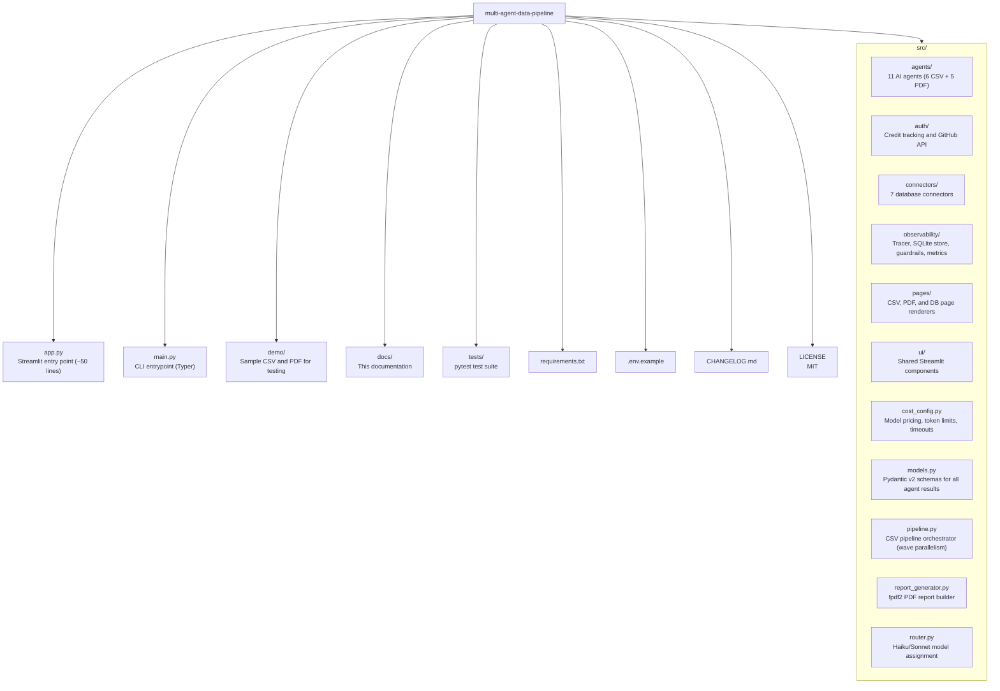

# Multi-Agent Data Pipeline

> 11 autonomous AI agents that clean, validate, transform, and summarise your data

---

## Quick Start

```bash
pip install -r requirements.txt
cp .env.example .env  # then edit with your key
python main.py demo/sample_data.csv
streamlit run app.py
```

Open [http://localhost:8501](http://localhost:8501) for the web UI.  
Dashboard at [http://localhost:8501/observability](http://localhost:8501/observability).

---

## Documentation

| Document | Description |
|----------|-------------|
| [Architecture & Design](architecture.md) | System design, agent waves, pipeline flow, and data flow diagrams |
| [API Reference](api-reference.md) | CLI commands, Python API, agent `run()` signatures, and connector interfaces |
| [Agent Documentation](agents.md) | All 11 agents — prompts, inputs, outputs, model assignments, and fallbacks |
| [Database Connectors](connectors.md) | Setup and usage for Databricks, Snowflake, PostgreSQL, MySQL, BigQuery, DuckDB, Redshift |
| [Observability & Guardrails](observability.md) | Tracing, SQLite persistence, 7-tab dashboard, budget/timeout/PII guardrails |
| [Configuration Reference](configuration.md) | Model IDs, pricing, token limits, timeouts, environment variables, and credits |

---

## Key Features

- **6 CSV agents** — Cleaner, PII Anonymiser, Validator, Transformer, Anomaly Detector, Summariser
- **5 PDF agents** — Parser, Entity Extractor, Risk Detector, Action Extractor, Summariser
- **Smart Router Engine** — routes simple tasks to Haiku (cheap) and complex tasks to Sonnet (quality)
- **Parallel wave execution** — Wave 1 agents run concurrently, Wave 2 runs after with full context
- **SQLite observability** — per-run tracing, cost tracking, latency, and a 7-tab dashboard
- **7 database connectors** — Databricks, Snowflake, PostgreSQL, MySQL, BigQuery, DuckDB, Redshift
- **Guardrails engine** — budget caps, agent timeouts, PII limits, parse failure thresholds
- **GitHub credit system** — 2 free runs, star bonus, BYOK for unlimited access
- **CI/CD** — GitHub Actions with lint (ruff) + test matrix (Python 3.10-3.12)
- **Code quality** — Ruff for linting and formatting, 44 passing tests

---

## System Requirements

| Requirement | Detail |
|-------------|--------|
| **Python** | 3.10 or later |
| **Anthropic API key** | Required — get one free at [console.anthropic.com](https://console.anthropic.com) |
| **RAM** | 2 GB minimum |
| **Disk** | ~100 MB for dependencies |

---

## Repository Structure



---

## Agent Routing

| Agent | Model | Reason |
|-------|-------|--------|
| Cleaner | Haiku | Mechanical formatting |
| PII Anonymiser | Haiku | Pattern-based detection |
| Transformer | Haiku | Structured column derivation |
| Validator | Sonnet | Schema judgment requires reasoning |
| Anomaly Detector | Sonnet | Statistical reasoning |
| Summariser | Sonnet | Business insights |
| PDF Parser | Haiku | Document structure extraction |
| Entity Extractor | Haiku | Pattern-based NER |
| Risk Detector | Sonnet | Compliance reasoning |
| Action Extractor | Sonnet | Decision extraction |
| PDF Summariser | Sonnet | Executive summary |

Disable routing with `routing_enabled=False` — all agents use Sonnet.

---

## Version & License

- **Version**: 2.1.0
- **License**: MIT
- **Author**: Harshit Tripathi / [Britcore.AI](https://britcore.ai) ([@harshitboots](https://github.com/harshitboots))
