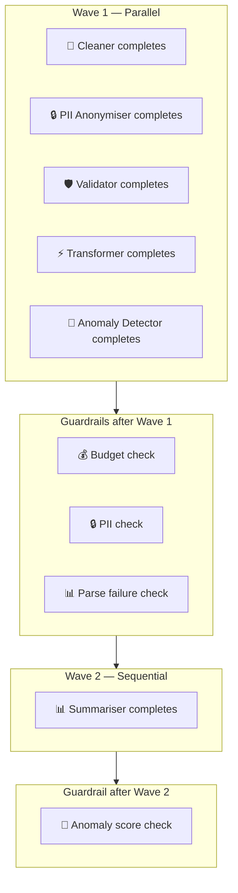

# Observability & Guardrails

> Per-run tracing, cost tracking, SQLite persistence, and a guardrails engine that stops runaway pipelines before they burn your budget.

---

## Overview

Every pipeline run is automatically traced, costed, and persisted to SQLite (`pipeline_runs.db`). The observability system has four layers:

| Layer | File | Purpose |
|-------|------|---------|
| **Tracing** | `src/observability/tracer.py` | Per-run spans — tokens, cost, latency, raw responses |
| **Storage** | `src/observability/store.py` | SQLite persistence — runs, spans, guardrail events |
| **Guardrails** | `src/observability/guardrails.py` | Budget, timeout, PII, parse failure, and anomaly checks |
| **Metrics** | `src/observability/metrics.py` | Analytics queries — cost trends, agent performance, quality scores |

---

## Tracing System

### RunTracer

A `RunTracer` wraps an entire pipeline run. Create one at the start of each run and pass it to every agent.

```python
from src.observability.tracer import RunTracer

tracer = RunTracer(source="csv_upload", mode="with_router")
```

**Properties:**

| Property | Type | Description |
|----------|------|-------------|
| `run_id` | `str` | 8-character UUID (e.g. `a3f1b2c9`) |
| `source` | `str` | Data source identifier |
| `mode` | `str` | `with_router` or `no_router` |
| `spans` | `list[AgentSpan]` | All agent spans for this run |
| `total_cost_gbp` | `float` | Sum of all span costs |
| `total_latency_ms` | `int` | Wall-clock time since tracer started |
| `total_input_tokens` | `int` | Sum of input tokens across all spans |
| `total_output_tokens` | `int` | Sum of output tokens across all spans |
| `parse_failures` | `int` | Count of spans where `parse_ok=False` |
| `timeout_count` | `int` | Count of spans where `status="timeout"` |
| `guardrail_events` | `list` | All guardrail events from all spans |

### AgentSpan

An `AgentSpan` tracks one agent's execution within a run. Created via `tracer.start_span()`, finished via `span.finish()` or `span.finish_timeout()`.

```python
span = tracer.start_span(
    agent_name="cleaner",
    model="claude-haiku-4-5-20251001",
    system_prompt="You are a data cleaning agent...",
    user_message="Clean this CSV: ..."
)

# After the agent completes:
span.finish(
    input_tokens=1200,
    output_tokens=800,
    model="claude-haiku-4-5-20251001",
    raw_response='{"issues_fixed": [...]}',
    parsed_output='{"issues_fixed": [...]}',
    parse_ok=True
)
```

**Fields:**

| Field | Type | Default | Description |
|-------|------|---------|-------------|
| `run_id` | `str` | — | Parent run ID |
| `agent_name` | `str` | — | Agent identifier |
| `model` | `str` | — | Model used |
| `input_tokens` | `int` | `0` | Prompt tokens consumed |
| `output_tokens` | `int` | `0` | Completion tokens generated |
| `cost_gbp` | `float` | `0.0` | Cost in GBP |
| `latency_ms` | `int` | `0` | Wall-clock latency |
| `status` | `str` | `"pending"` | `pending` -> `complete` / `error` / `timeout` |
| `parse_ok` | `bool` | `True` | Whether JSON parse succeeded |
| `system_prompt` | `str` | `""` | Truncated to 1000 chars |
| `user_message` | `str` | `""` | Truncated to 500 chars |
| `raw_response` | `str` | `""` | Truncated to 2000 chars |
| `parsed_output` | `str` | `""` | Truncated to 2000 chars |
| `error_message` | `str` | `""` | Error details if failed |
| `guardrails_fired` | `list` | `[]` | Guardrail events for this span |
| `started_at` | `float` | `time.time()` | Span start timestamp |

### Span Lifecycle

```
tracer.start_span()  ->  Agent executes  ->  span.finish()
                                               |-> parse_ok=True, status="complete"
                                               |-> parse_ok=False, status="error"
                                               |-> span.finish_timeout()  ->  status="timeout"
```

`span.finish()` calculates latency, computes cost from the model's pricing in `cost_config.py`, truncates large fields, and sets status. `span.finish_timeout()` sets `status="timeout"`, `parse_ok=False`, and adds an error message.

---

## SQLite Schema

Four tables in `pipeline_runs.db` (auto-created on first run, gitignored).

### runs

One row per pipeline run.

```sql
CREATE TABLE runs (
    run_id TEXT PRIMARY KEY,
    timestamp TEXT,
    source TEXT,
    mode TEXT,
    total_cost_gbp REAL,
    total_latency_ms INTEGER,
    total_input_tokens INTEGER,
    total_output_tokens INTEGER,
    agent_count INTEGER,
    parse_failures INTEGER,
    timeout_count INTEGER,
    guardrail_events INTEGER,
    status TEXT
);
```

| Column | Description |
|--------|-------------|
| `run_id` | 8-char UUID, primary key |
| `timestamp` | ISO 8601 timestamp |
| `source` | Data source (e.g. `csv_upload`, `pdf_upload`, `databricks`) |
| `mode` | `with_router` or `no_router` |
| `total_cost_gbp` | Total cost of the run in GBP |
| `total_latency_ms` | Total wall-clock latency |
| `total_input_tokens` | Sum of input tokens across all agents |
| `total_output_tokens` | Sum of output tokens across all agents |
| `agent_count` | Number of agents that executed |
| `parse_failures` | Count of agents with `parse_ok=False` |
| `timeout_count` | Count of agents that timed out |
| `guardrail_events` | Count of guardrail events fired |
| `status` | `complete` or `error` |

### agent_spans

One row per agent execution within a run.

```sql
CREATE TABLE agent_spans (
    id INTEGER PRIMARY KEY AUTOINCREMENT,
    run_id TEXT,
    agent_name TEXT,
    model TEXT,
    input_tokens INTEGER,
    output_tokens INTEGER,
    cost_gbp REAL,
    latency_ms INTEGER,
    status TEXT,
    parse_ok INTEGER,
    system_prompt TEXT,
    user_message TEXT,
    raw_response TEXT,
    parsed_output TEXT,
    error_message TEXT,
    guardrails_fired TEXT
);
```

| Column | Description |
|--------|-------------|
| `id` | Auto-increment row ID |
| `run_id` | Foreign key to `runs.run_id` |
| `agent_name` | Agent identifier (e.g. `cleaner`, `validator`) |
| `model` | Full model ID (e.g. `claude-haiku-4-5-20251001`) |
| `input_tokens` | Prompt tokens consumed |
| `output_tokens` | Completion tokens generated |
| `cost_gbp` | Agent cost in GBP |
| `latency_ms` | Agent latency in milliseconds |
| `status` | `complete`, `error`, or `timeout` |
| `parse_ok` | `1` if JSON parsed, `0` if not |
| `system_prompt` | System prompt (truncated to 1000 chars) |
| `user_message` | User message (truncated to 500 chars) |
| `raw_response` | Raw API response (truncated to 2000 chars) |
| `parsed_output` | Parsed JSON output (truncated to 2000 chars) |
| `error_message` | Error details if failed |
| `guardrails_fired` | JSON list of guardrail events |

### guardrail_events

One row per guardrail event across all runs.

```sql
CREATE TABLE guardrail_events (
    id INTEGER PRIMARY KEY AUTOINCREMENT,
    run_id TEXT,
    agent_name TEXT,
    guardrail_type TEXT,
    value TEXT,
    threshold TEXT,
    action TEXT,
    severity TEXT,
    timestamp TEXT
);
```

| Column | Description |
|--------|-------------|
| `id` | Auto-increment row ID |
| `run_id` | Foreign key to `runs.run_id` |
| `agent_name` | Agent that triggered the event (or `pipeline`) |
| `guardrail_type` | Type: `budget`, `pii`, `completeness`, `anomaly_score`, `parse_failures` |
| `value` | Actual measured value (stored as text) |
| `threshold` | Configured threshold (stored as text) |
| `action` | Action taken: `continue`, `warn`, `stop`, `skip` |
| `severity` | `info`, `warning`, or `critical` |
| `timestamp` | ISO 8601 timestamp |

### budget

Single-row table tracking cumulative spend across all runs.

```sql
CREATE TABLE budget (
    id INTEGER PRIMARY KEY CHECK (id = 1),
    total_spent_gbp REAL DEFAULT 0,
    run_count INTEGER DEFAULT 0,
    last_updated TEXT
);
```

| Column | Description |
|--------|-------------|
| `total_spent_gbp` | Total GBP spent across all runs |
| `run_count` | Total number of runs executed |
| `last_updated` | ISO 8601 timestamp of last update |

---

## Guardrails Engine

The `GuardrailEngine` runs checks before, during, and after agent execution. Each check returns a `GuardrailResult` with an action (`continue`, `warn`, `stop`, `skip`) and severity level.

### Configuration

```python
from src.observability.guardrails import GuardrailEngine

guardrails = GuardrailEngine(
    budget_cap_gbp=0.50,       # stop if total spend exceeds this
    agent_timeout_s=30,         # timeout per agent in seconds
    min_completeness=60.0,      # warn if completeness score drops below this
    max_pii_rows=0,             # warn if PII rows exceed this (0 = any PII triggers warning)
    max_parse_failures=3,       # stop if this many agents fail JSON parse
    anomaly_score_warn=9.0,     # warn if anomaly score exceeds this (out of 10)
    enabled=True                # enable/disable all guardrails
)
```

### GuardrailResult

Every check returns a `GuardrailResult`:

```python
@dataclass
class GuardrailResult:
    passed: bool                           # True if check passed
    action: Literal["continue", "warn", "stop", "skip"]
    reason: str                            # Human-readable explanation
    severity: Literal["info", "warning", "critical"]
    guardrail_type: str                    # e.g. "budget", "parse_failures"
    value: float                           # Actual measured value
    threshold: float                       # Configured threshold

    def as_event(self, agent_name: str) -> dict:
        # Converts to a dict for SQLite storage
```

### 6 Guardrail Checks

#### 1. Budget Check

```python
result = guardrails.check_budget(spent_so_far_gbp=0.42)
```

| Condition | Action | Severity |
|-----------|--------|----------|
| `spent >= cap` | `stop` | `critical` |
| `spent >= cap * 0.8` | `warn` | `warning` |
| `spent < cap * 0.8` | `continue` | `info` |

**When it fires:** After Wave 1 completes in the CSV pipeline.

#### 2. PII Check

```python
result = guardrails.check_pii(pii_rows=2)
```

| Condition | Action | Severity |
|-----------|--------|----------|
| `pii_rows > max_pii_rows` | `warn` | `warning` |
| `pii_rows <= max_pii_rows` | `continue` | `info` |

Default `max_pii_rows=0` means any PII detected triggers a warning.

**When it fires:** After Wave 1 completes (if `pii_anonymiser` ran).

#### 3. Completeness Check

```python
result = guardrails.check_completeness(score=55.0)
```

| Condition | Action | Severity |
|-----------|--------|----------|
| `score < min_completeness` | `warn` | `warning` |
| `score >= min_completeness` | `continue` | `info` |

Default threshold: 60%.

**When it fires:** After Wave 1 completes (validator output).

#### 4. Anomaly Score Check

```python
result = guardrails.check_anomaly_score(score=9.5)
```

| Condition | Action | Severity |
|-----------|--------|----------|
| `score >= anomaly_score_warn` | `warn` | `warning` |
| `score < anomaly_score_warn` | `continue` | `info` |

Default threshold: 9.0/10.

**When it fires:** After Wave 2 (summariser) completes.

#### 5. Parse Failure Check

```python
result = guardrails.check_parse_failures(failure_count=3)
```

| Condition | Action | Severity |
|-----------|--------|----------|
| `failures >= max_parse_failures` | `stop` | `critical` |
| `failures < max_parse_failures` | `continue` | `info` |

Default threshold: 3 failures. When this fires, the pipeline halts immediately.

**When it fires:** After Wave 1 completes.

#### 6. Timeout Check

Handled at the span level via `span.finish_timeout()`. Agent-level timeouts don't go through the guardrails engine directly — the pipeline catches the timeout and records it. The `GuardrailEngine` tracks timeout counts as a property for downstream checks.

### When Guardrails Fire in Pipeline



---

## Metrics

Analytics queries over the SQLite store. All functions read from `pipeline_runs.db`.

### run_quality_score

```python
from src.observability.metrics import run_quality_score

score = run_quality_score("a3f1b2c9")  # returns 0.0-100.0
```

**Formula:**
```
(parse_ok / total_spans) * 100 - (timeouts * 15) - (errors * 10)
```

Higher is better. 100 = all agents parsed successfully with no timeouts or errors.

### cost_trend

```python
from src.observability.metrics import cost_trend

trend = cost_trend(limit=20)
# [{"run_id": "a3f1b2c9", "timestamp": "2026-07-01T12:00:00", "cost_gbp": 0.08, "mode": "with_router"}]
```

Returns cost per run over time, ordered chronologically.

### agent_performance_table

```python
from src.observability.metrics import agent_performance_table

table = agent_performance_table()
# [{"agent": "cleaner", "runs": 15, "avg_latency_s": 1.2, "avg_cost_gbp": 0.003,
#   "parse_fail_pct": 0.0, "error_rate_pct": 0.0, "timeout_rate_pct": 0.0, "reliability_pct": 100.0}]
```

Per-agent reliability stats across all runs.

### model_usage_breakdown

```python
from src.observability.metrics import model_usage_breakdown

breakdown = model_usage_breakdown()
# {"haiku_gbp": 0.24, "sonnet_gbp": 0.82}
```

Total spend split by model tier.

### summary_stats

```python
from src.observability.metrics import summary_stats

stats = summary_stats()
# {"total_runs": 42, "total_cost_gbp": 3.36, "avg_cost_gbp": 0.08,
#  "avg_latency_s": 5.2, "success_rate_pct": 97.6}
```

---

## Dashboard

7-tab Streamlit dashboard at `pages/observability.py`. Open at `http://localhost:8501/observability`.

| Tab | Description |
|-----|-------------|
| **Compare Runs** | Side-by-side baseline vs router — cost, latency, parse success, savings |
| **Live Monitor** | Last run — agent waterfall with latency bars, cost per agent, prompt inspector |
| **Run History** | All runs in a table — click to drill into per-agent spans |
| **Cost Analytics** | Spend over time, Haiku vs Sonnet breakdown, cost by mode |
| **Agent Performance** | Reliability %, avg latency, avg cost, parse failure rate per agent |
| **Guardrails Log** | Every guardrail event — severity, value vs threshold, action taken |
| **Settings** | Configure guardrail thresholds — budget cap, timeout, PII limits |

---

## Code Examples

### Basic Tracing

```python
from src.observability.tracer import RunTracer

tracer = RunTracer(source="csv_upload", mode="with_router")

# Start a span for each agent
span = tracer.start_span("cleaner", model="claude-haiku-4-5-20251001")

# ... agent executes ...

span.finish(
    input_tokens=1200,
    output_tokens=800,
    model="claude-haiku-4-5-20251001",
    raw_response='{"issues_fixed": ["Fixed dates"]}',
    parsed_output='{"issues_fixed": ["Fixed dates"]}',
    parse_ok=True
)

# Check totals
print(f"Total cost: £{tracer.total_cost_gbp:.4f}")
print(f"Total latency: {tracer.total_latency_ms}ms")
print(f"Parse failures: {tracer.parse_failures}")
```

### Querying the Store

```python
import sqlite3

conn = sqlite3.connect("pipeline_runs.db")

# Get last 5 runs
runs = conn.execute(
    "SELECT run_id, timestamp, total_cost_gbp, mode FROM runs ORDER BY timestamp DESC LIMIT 5"
).fetchall()

# Get all spans for a run
spans = conn.execute(
    "SELECT agent_name, model, cost_gbp, latency_ms, status FROM agent_spans WHERE run_id = ?",
    ("a3f1b2c9",)
).fetchall()

# Get guardrail events for a run
events = conn.execute(
    "SELECT guardrail_type, action, severity, value, threshold FROM guardrail_events WHERE run_id = ?",
    ("a3f1b2c9",)
).fetchall()

conn.close()
```

### Configuring Guardrails

```python
from src.observability.guardrails import GuardrailEngine

# Strict mode — tight budget, low tolerance
strict = GuardrailEngine(
    budget_cap_gbp=0.20,
    agent_timeout_s=15,
    min_completeness=80.0,
    max_pii_rows=0,
    max_parse_failures=2,
    anomaly_score_warn=8.0
)

# Relaxed mode — higher budget, more tolerance
relaxed = GuardrailEngine(
    budget_cap_gbp=1.00,
    agent_timeout_s=60,
    min_completeness=40.0,
    max_pii_rows=10,
    max_parse_failures=5,
    anomaly_score_warn=9.5
)

# Disable guardrails entirely
disabled = GuardrailEngine(enabled=False)
```

### Running a Guardrail Check

```python
from src.observability.guardrails import GuardrailEngine

guardrails = GuardrailEngine(budget_cap_gbp=0.50)

result = guardrails.check_budget(spent_so_far_gbp=0.42)

if result.action == "stop":
    print(f"Pipeline stopped: {result.reason}")
    # Save event to SQLite
    store.save_guardrail_event(run_id, "pipeline", result.as_event("pipeline"))
elif result.action == "warn":
    print(f"Warning: {result.reason}")
else:
    print("Budget check passed")
```

---

## File Summary

| File | Lines | Purpose |
|------|-------|---------|
| `src/observability/tracer.py` | ~120 | `RunTracer` and `AgentSpan` classes |
| `src/observability/store.py` | ~150 | SQLite CRUD — save/load runs, spans, events |
| `src/observability/guardrails.py` | ~180 | `GuardrailEngine` with 6 checks |
| `src/observability/metrics.py` | ~140 | Analytics queries over SQLite |
| `pages/observability.py` | ~800 | 7-tab Streamlit dashboard |
